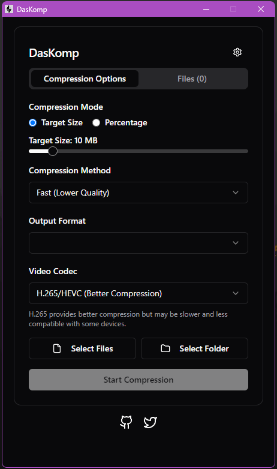

# DasKomp
A simple compression app always ready to be used !

<div align="center">
  
  <h3>A simple, powerful file compression tool for desktop</h3>
</div>


## Overview

DasKomp is an open-source desktop application that makes file compression simple and efficient. Whether you need to compress videos, images, or folders for sharing or storage, DasKomp provides an intuitive interface with powerful compression capabilities.



## Features

- **Multiple Compression Modes**:
  - Target size - Compress files to a specific file size (MB)
  - Percentage - Reduce file size by a percentage of the original
  
- **Support for Various File Types**:
  - Videos (mp4, webm, mov, avi, mkv)
  - Images (jpg, png, webp)
  - Folders and other file types

- **Customizable Settings**:
  - Compression method selection (Auto, Fast, Balanced, High Quality)
  - Video codec options (H.264, H.265/HEVC)
  - Output format selection

- **User-Friendly Interface**:
  - Modern, clean UI with dark mode support
  - Intuitive file and folder selection
  - Progress tracking during compression

- **Persistent Settings**:
  - Remembers your output folder and preferences

## Installation

### Download

Download the latest release for your operating system from the [Releases](https://github.com/Chirraaa/DasKomp/releases) page.

### Build from Source

Prerequisites:
- Node.js (v14 or higher)
- npm or yarn

```bash
# Clone the repository
git clone https://github.com/Chirraaa/DasKomp.git

# Navigate to the project directory
cd DasKomp

# Install dependencies
npm install
# or
yarn install

# Start the development server
npm run dev
# or
yarn dev

# Build for production
npm run build
# or
yarn build
```

## Usage

1. **Select Files or Folders**:
   - Click "Select Files" or "Select Folder" to choose what you want to compress
   - Multiple files can be selected at once

2. **Choose Compression Settings**:
   - Set your target size or compression percentage
   - Select compression method based on your speed/quality preference
   - Choose desired output format and video codec (for videos)

3. **Select Output Location**:
   - Click the "Settings" icon (⚙️) to open settings
   - Set your output folder using the "Browse" button

4. **Start Compression**:
   - Click "Start Compression" button
   - Wait for the process to complete
   - Access your compressed files using the "Open Output Location" button

## Technical Details

DasKomp is built with:
- Electron - For cross-platform desktop functionality
- React - For the user interface
- TypeScript - For type-safe code
- shadcn/ui - For UI components
- FFmpeg - For video and image processing (wrapped in the backend)

## Contributing

Contributions are welcome! Please feel free to submit a Pull Request.

1. Fork the repository
2. Create your feature branch (`git checkout -b feature/amazing-feature`)
3. Commit your changes (`git commit -m 'Add some amazing feature'`)
4. Push to the branch (`git push origin feature/amazing-feature`)
5. Open a Pull Request

## License

This project is licensed under the MIT License - see the [LICENSE](LICENSE) file for details.

## Connect

- [GitHub](https://github.com/Chirraaa/DasKomp)
- [Twitter](https://twitter.com/ChirraaaB)

## Acknowledgments

- [FFmpeg](https://ffmpeg.org/) for providing the core compression capabilities
- [shadcn/ui](https://ui.shadcn.com/) for the beautiful UI components
- All the open-source libraries that made this project possible
